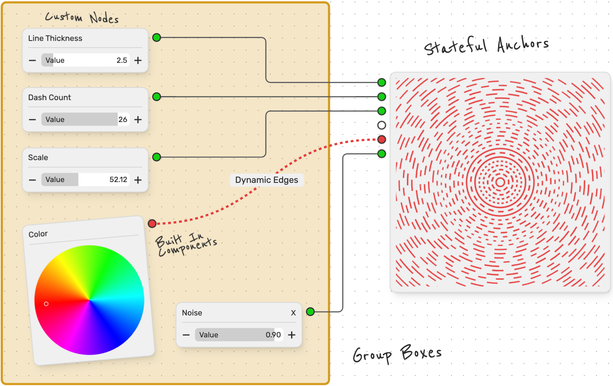
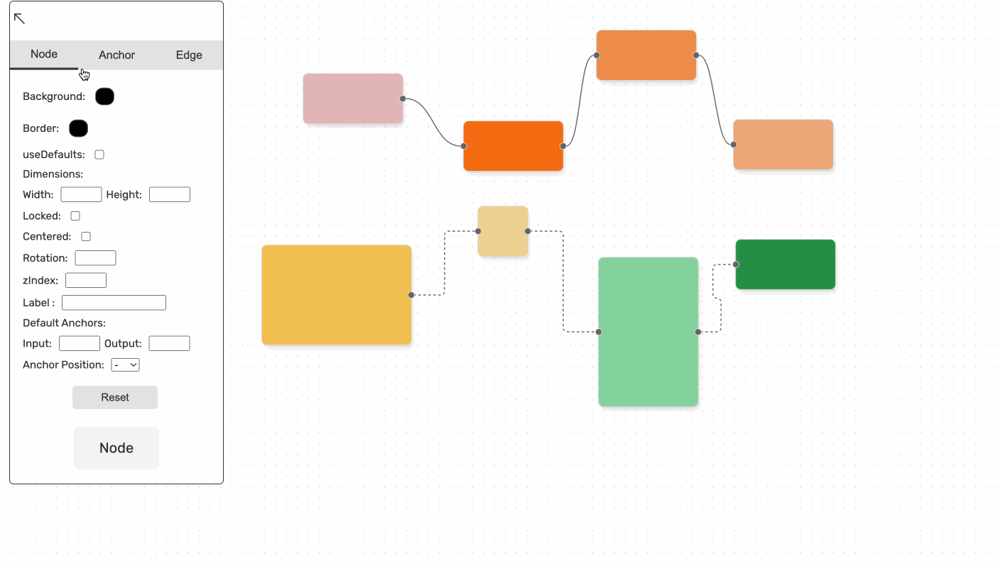
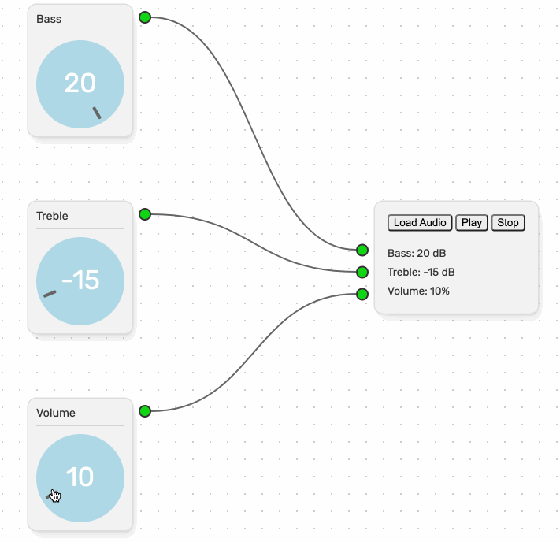
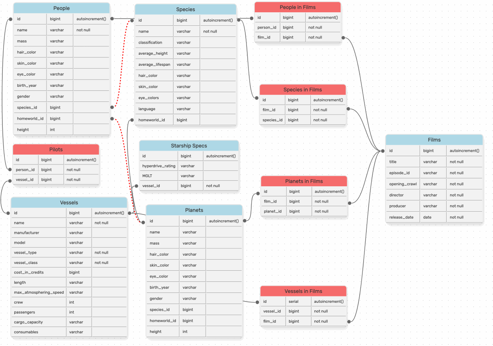

 

# Infinitely Customizable Node-Based User Interfaces with Svelvet!

Svelvet is a lightweight Svelte component library for building interactive node-based user interfaces and diagrams.

[⚡ Website](https://www.svelvet.io/) | [📚 Documentation](https://svelvet.mintlify.app) | [⌨️ Blog](https://medium.com/@rathnaganjigunta/introducing-svelvet-8-new-features-for-a-user-friendly-svelte-component-library-c9b966c5eb75) | [💼 LinkedIn](https://www.linkedin.com/company/svelvet/)

 

## 🚀 New Features 🚀

- **Drawer Component:** A new drag-and-drop component that can take default Nodes, custom Nodes, Anchors and Edges as props and add them to the canvas via the UI.

  

- **Knob Component:** A new input component to the data flow system that can be composed in custom nodes and customized by users.

  

 

- **Usecase Examples:** A brand new _Examples_ section to the documentation that features a usecase of Svelvet as a Database Visualization tool. 

  

 

## Version 8.0.0 Updates

### Changelog

- feat: added a new drag-and-drop Drawer component that can create default and custom Nodes, Anchors and Edges as props and add them to the canvas via the UI
- feat: added a new input component, Knob, to the collection of already existing data flow system components that can be composed in custom nodes and customized by users
- docs: updated documentation to include an Example section that features a usecase of Svelvet as a Database Visualization tool
- docs: updated the documentation page on the website to include newest version release
- test: added Unit and Component testing using Vitest and Svelte Testing Library
- refactor: updated website styling: consolidated redundant CSS classes, fixed broken links and styling issues
- chore: updated home page to include newest collaborators
- chore: updated testing suite package versions

### Roadmap

Please refer to the [roadmap](https://svelvet.mintlify.app/roadmap) for the full list of ideas for iteration.  
Some ideas inspired by v8.0.0 include:

- **Example Showcase:** we've added a new section to the documentation which will contain example sandboxes of features and potential usecases of Svelvet. If you would like to contribute to the showcase with an example of how you’re using Svelvet, reach out to the team with your project via [Github discussion](https://github.com/open-source-labs/Svelvet/discussions/categories/project-showcase).
- **Additional functionality to the Drawer Component:** we are planning to make updates to address the ablity to 1) take custom Nodes as props, 2) edit and remove nodes that already exisits on the canvas 3) export the canvas as JSON or PDF file.
- **Additional Data Input Components:** we plan on creating additional input/parameter components that integrate with our data flow system and can be used when composing custom Nodes.

- **Extensive Test Converage:** We expect to have full E2E and unit test coverage relatively soon.

 

## The Svelvet v8 Team

- Rathna Chinthalapalli • [LinkedIn](https://www.linkedin.com/in/rathnac/) • [Github](https://github.com/rathna-git)
- Ruxin Zheng • [LinkedIn](https://www.linkedin.com/in/ruxinzhengswe/) • [Github](https://github.com/RuxinZ)
- Samuel Alvarez • [LinkedIn](https://www.linkedin.com/in/samuelsalvarez/) • [Github](https://github.com/bittermelonsam)
- Wesley Waters • [LinkedIn](https://www.linkedin.com/in/wesley-w-332882248/) • [Github](https://github.com/Wesley-Waters)

- _Tech Lead_: Brian Holmes • [LinkedIn](https://www.linkedin.com/in/briangregoryholmes/) • [Github](https://github.com/briangregoryholmes)

 

## Technologies

 

## Credits

Inspired by [React Flow](https://github.com/wbkd/react-flow), Svelvet expands the tools available to Svelte developers and makes Svelte more inviting to both new and seasoned software engineers.

 

## License

Svelvet is developed under the [MIT license](https://github.com/open-source-labs/Svelvet-website/blob/main/LICENSE).
